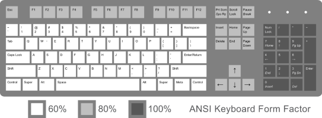
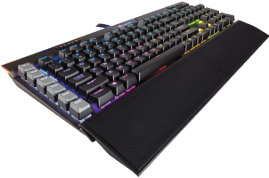
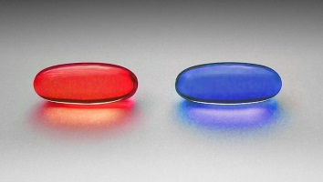
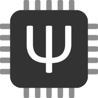

## Fully Customizing Your Keyboard
Using the power of Open Source firmware to take control of your tools

---

## Keyboard Basics

Most people use the same general keyboard

*[ANSI Keyboard Layout Diagram with Form Factor](https://commons.wikimedia.org/wiki/File:ANSI_Keyboard_Layout_Diagram_with_Form_Factor.svg) by Rumudiez is licensed under [Creative Commons](https://en.wikipedia.org/wiki/en:Creative_Commons) [Attribution-Share Alike 3.0 Unported](https://creativecommons.org/licenses/by-sa/3.0/deed.en) license*

* Standard 104 keys
* Standard layout
* "Good enough" for most people

note:
* Standard design is cheap (to produce) and familiar
* Learn to work around things that you don't like. Why?
* Do you really use all of the keys and have no complaints about the layout?

---

## Baby Steps

"Macro Keys"

* 5 - 10 keys that you can customize
* But they are usually on the side/hard to reach for general use

*[K95 RGB PLATINUM Mechanical Gaming Keyboard](https://www.corsair.com/eu/en/Color/Keyboard-Model/Key-Switches/Keyboard-Layout/k95-rgb-platinum-config-na/p/CH-9127114-NA) by Corsair*

note:
* You may have seen these - some "gamer" keyboards have them
* Varying levels of customization - usually a dropdown of selectable options or a single key press
* Being hard to reach means less frequent use and lowers usefulness

---

## Intermediate Control

GUI or finer control

* More useful as you can control more/all of the keys
* Basic tweaks to make things useful

[Interactive Example](http://configure.ergodox-ez.com/)

note:
* Mostly let you move keys around. No further customization
* The control software is on your OS. Changing OSes or using VMs means you lose your configuration
* Being in a propriatery format means you can't share it or export it

---

## Red Pill And Blue Pill Decision

*[Red and blue pill](https://commons.m.wikimedia.org/wiki/File:Red_and_blue_pill.jpg) by W.carter is licensed under [Creative Commons](https://en.wikipedia.org/wiki/en:Creative_Commons) [Attribution-Share Alike 3.0 Unported](https://creativecommons.org/licenses/by-sa/3.0/deed.en) license*

* Blue Pill - Be satisfied with only knowing everything till this point
* Red Pill - Never be satisfied with the above
    * Will result in lost $$$ on a new keyboard

note:
* You can drop off now or continue down the rabbit hole
* If you continue, your wallet has been warned
* Like finding out about copy/paste, but with an initiation fee

---

## What Does Full Control Look Like?

* Work across Operating Systems
* Fully change any keys
* Share or save your layout
* Additional nice-to-haves

---

## The Solution? Open Source!

[QMK](https://qmk.fm/) and [TMK](https://github.com/tmk/tmk_keyboard) open source keyboard firmware

* Supported on many devices
* Can be tweaked and changed to suit your needs
* Works across many types of keyboards

note:
* QMK - Quantum Mechanical Keyboard
    * Fork of TMK, have since diverged with features
* TMK - Couldn't find what it stands for

---

## What Does Keyboard Firmware Look Like?

*Logo owned by [QMK Firmware](https://qmk.fm/)*

1. Full control of your keyboard via a [keymap.c](https://github.com/bpruitt-goddard/qmk_firmware/blob/new-keymap/keyboards/ergodox_ez/keymaps/bpruitt-goddard/keymap.c) file
2. Complied into a hex file
3. Flashed to keyboard

note:
* From here on, QMK-specific details
* Do everything inside your keymap file
* Being a program, you get full control

---

## On-device Benefits

* Take anywhere - not bound by an OS/software
* Global layout changes

note:
* Traditionally, changing to a non-QWERTY layout has been painful if you change OSes. Not anymore!
* Making changes anywhere handy for travel and working in VMs

---

## Layers - The Bread and Butter Feature
Why limit yourself to each key doing one thing, when they can do _n_ things? Define unique layers to keep things organized and move unused keys out of your layer.

* Function key layer
* Numpad layer
* Program-specific layer

note:
* Move rarely-used keys to dedicated layer
* No more dead/unused keys!
* Map shortcuts to one key in your layer

---

## Features You Didn't Know You Were Missing

* Make your keys do more than simply type a character
* Provide advanced Firmware-specific nice-to-haves

--

## Space Cadet Shift

Super Shift Key
* Hold -> Normal Shift
* Press -> `(` or `)` (Left vs Right shift)

--

## Dynamic Macro

Record a string of characters in any application... and replay them back!

--

## Multi-Purpose Keys

Make more use out of your keys than simple tap -> key

### Tap Dance
* Tap once - press `ESC`
* Tap twice - press `Caps Lock`

### Mod Tap
* Tap - Escape
* Hold - Control

note:
* Tap Dance - Allows the key to behave differently depending on number of taps
    * Personal Example - press key twice - record dynamic macro, press once to replay
* Mod Tap - Modifier when held, key when tapped

---

## Be In Charge Of Your Keyboard

* Your keyboard should be tailored to your unique usage
* Your keyboard should be constantly evolving

note:

* You don't use your keyboard the same way others do
* You don't use your keyboard the same way used to
